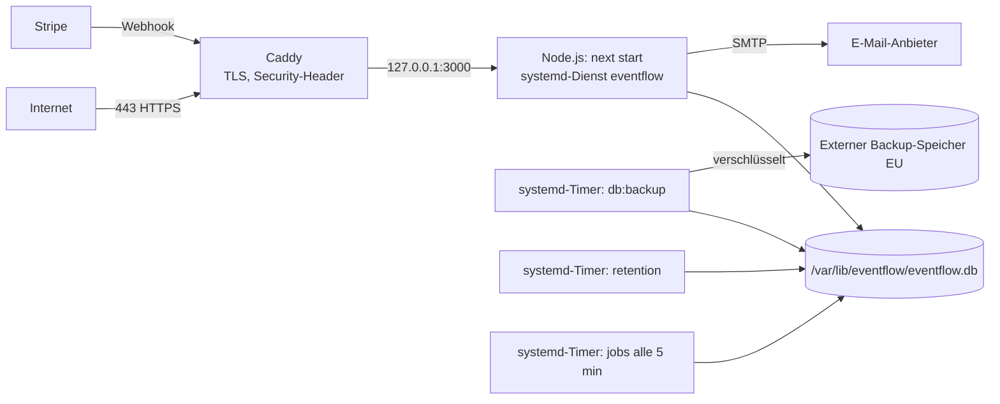

# EventFlow – Entwicklung & Deployment

Stand: 26.09.2026 · Status: **Entwurf 2 zur Diskussion** – beschreibt den Zielzustand nach der Migration (siehe `MIGRATIONSPLAN.md`). Ersetzt die bisherige `DEPLOYMENT.md` (Vercel/Firebase) und `HOMELAB_DEPLOYMENT.md`.

Kurzfassung:
- **Jetzt bis zur Fertigstellung:** rein lokal unter Windows mit `npm run dev`, SQLite-Datei im Projektordner, Stripe im Testmodus, E-Mails als Dateien.
- **Zum Schluss:** ein VPS bei einem EU-Hoster, Node.js als systemd-Dienst hinter Caddy (HTTPS). **Kein Docker.**

---

## Teil A – Lokale Entwicklung (Windows)

### A.1 Voraussetzungen

| Werkzeug | Zweck | Hinweis |
|---|---|---|
| Node.js 24 LTS | Laufzeit | Version steht in `.nvmrc` / `package.json` → `engines` |
| Git | Versionsverwaltung | |
| Visual Studio Build Tools (C++-Workload) | nur falls `better-sqlite3` kein vorkompiliertes Paket findet | normalerweise nicht nötig |
| Stripe CLI | Webhooks an `localhost` weiterleiten | ab Phase 5 |
| optional: DB Browser for SQLite | Datenbank ansehen | alternativ `npx drizzle-kit studio` |

### A.2 Einrichtung

```powershell
cd D:\aaa\python\Projekte\eventapp
npm ci
copy .env.example .env.local      # Werte eintragen, siehe A.3
npm run admin:create               # ersten Admin anlegen (fragt E-Mail + Passwort ab)
npm run seed:demo                  # optional: Demodaten (nur lokal!)
npm run dev                        # http://localhost:3000
```

Beim ersten Start legt die App `data\eventflow.db` an und führt alle Migrationen aus. Vor jeder späteren Migration wird automatisch eine Sicherung in `data\backups\` erstellt.

### A.3 Umgebungsvariablen (`.env.local`, nie committen)

| Variable | Lokal | Produktion | Beschreibung |
|---|---|---|---|
| `APP_URL` | `http://localhost:3000` | `https://<domain>` | Basis für Links in E-Mails, Stripe-Rücksprung |
| `DATABASE_PATH` | `data/eventflow.db` | `/var/lib/eventflow/eventflow.db` | SQLite-Datei |
| `BACKUP_DIR` | `data/backups` | `/var/lib/eventflow/backups` | lokale Sicherungen |
| `BETTER_AUTH_SECRET` | zufällig, ≥ 32 Zeichen | eigener, anderer Wert | Signatur von Sitzungen |
| `BETTER_AUTH_URL` | `http://localhost:3000` | `https://<domain>` | |
| `STRIPE_SECRET_KEY` | `sk_test_…` | `sk_live_…` | nur serverseitig |
| `STRIPE_WEBHOOK_SECRET` | von `stripe listen` ausgegeben | aus dem Stripe-Dashboard | Signaturprüfung |
| `MAIL_TRANSPORT` | `file` | `smtp` | `file` schreibt E-Mails nach `MAIL_OUTBOX_DIR` |
| `MAIL_OUTBOX_DIR` | `data/mail-outbox` | – | |
| `SMTP_HOST`, `SMTP_PORT`, `SMTP_USER`, `SMTP_PASS` | – | vom E-Mail-Anbieter | |
| `MAIL_FROM` | `EventFlow <noreply@localhost>` | `Veranstalter <noreply@<domain>>` | |

Veranstalterdaten für Rechnungen (Name, Anschrift, UID, Bank) stehen **nicht** in Umgebungsvariablen, sondern in der App unter Einstellungen (Tabelle `settings`).

Ein Stripe-Publishable-Key wird nicht benötigt: Die App leitet direkt auf die von Stripe gelieferte Checkout-URL weiter.

### A.4 Stripe lokal testen (ab Phase 5)

```powershell
stripe login
stripe listen --forward-to localhost:3000/api/stripe/webhook
```

`stripe listen` gibt ein `whsec_…` aus → als `STRIPE_WEBHOOK_SECRET` in `.env.local` eintragen und `npm run dev` neu starten. Bezahlt wird mit den Testkarten aus der Stripe-Dokumentation. Einzelne Ereignisse lassen sich mit `stripe trigger checkout.session.completed` auslösen.

### A.5 E-Mails lokal

Mit `MAIL_TRANSPORT=file` landen alle E-Mails als `.eml`-Dateien in `data\mail-outbox\` und lassen sich per Doppelklick in Outlook/Thunderbird öffnen. Es wird nichts verschickt.

### A.6 Ordner `data\` (gitignored)

```
data\
  eventflow.db          Datenbank (+ -wal, -shm im Betrieb)
  backups\              automatische und manuelle Sicherungen
  mail-outbox\          lokale E-Mails
  invoices\             erzeugte Rechnungs-PDFs
```

Echte Personendaten gehören nie ins Repository. Für Tests und Vorführungen nur `npm run seed:demo` verwenden.

### A.7 npm-Skripte

| Skript | Zweck |
|---|---|
| `dev` | Entwicklungsserver |
| `build` / `start` | Produktions-Build bzw. -Start (lokal zum Testen möglich) |
| `typecheck`, `lint`, `test` | Qualitätsprüfungen – müssen vor jedem Commit grün sein |
| `admin:create` | Admin-Benutzer anlegen |
| `seed:demo` | Demodaten in eine **leere** Datenbank schreiben; verweigert bei vorhandenen Daten |
| `db:backup` | konsistente Sicherung der laufenden Datenbank nach `BACKUP_DIR` |
| `retention` | Löschfristen anwenden (Spec 7.5); `--dry-run` zeigt nur an, was passieren würde |
| `jobs` | zeitgesteuerte Abläufe einmal ausführen: abgelaufene Reservierungen freigeben, Wartelisten-Angebote verschicken/weitergeben, Zahlungserinnerungen. Lokal bei Bedarf von Hand, produktiv per Timer |

### A.8 Getrennte Datenbanken statt Testmodus

Für Experimente einfach eine andere Datei verwenden:

```powershell
$env:DATABASE_PATH="data/experiment.db"; npm run dev
```

Es gibt bewusst keinen Umschalter zur Laufzeit.

---

## Teil B – Produktivbetrieb beim EU-Hoster (am Ende der Entwicklung)

### B.1 Anforderungen an den Hoster

- Rechenzentrum in der EU/EWR, Auftragsverarbeitungsvertrag (AVV) nach Art. 28 DSGVO verfügbar.
- VPS mit Ubuntu Server 24.04 LTS, **2 vCPU, 4 GB RAM** (der Next.js-Build auf dem Server braucht Speicher; mit 2 GB RAM zusätzlich Swap einrichten), 20 GB SSD.
- IPv4 + IPv6, Snapshots optional.
- Dazu: E-Mail-Versand über einen EU-Anbieter mit SMTP und AVV; Speicher für externe Backups (S3-kompatibel, EU).

### B.2 Architektur auf dem Server



| Pfad | Inhalt | Rechte |
|---|---|---|
| `/opt/eventflow/app` | Git-Checkout + Build | Benutzer `eventflow`, schreibgeschützt im Betrieb (außer `.next/cache`) |
| `/var/lib/eventflow` | Datenbank, `backups/`, `invoices/` | nur `eventflow` |
| `/etc/eventflow/eventflow.env` | Umgebungsvariablen (Teil A.3, Spalte Produktion) | `root:eventflow`, `chmod 640` |

### B.3 Server einrichten (einmalig)

1. **Grundabsicherung:** SSH nur mit Schlüssel, Passwort-Login und Root-Login aus; Firewall (`ufw`) nur 22, 80, 443; `unattended-upgrades` für Sicherheitsupdates.
2. **Benutzer:** Systembenutzer `eventflow` ohne Login-Shell.
3. **Node.js 24 LTS** über das NodeSource-Repository installieren; dazu `build-essential` und `python3` (falls `better-sqlite3` kompiliert werden muss) sowie `git`.
4. **Caddy** über das offizielle apt-Repository installieren.
5. **Verzeichnisse** aus B.2 anlegen, Rechte setzen, Umgebungsdatei befüllen.
6. **DNS:** A- und AAAA-Eintrag der Domain auf den Server.

### B.4 App installieren und bauen

```bash
sudo -u eventflow git clone https://github.com/Kodikodiko/eventapp.git /opt/eventflow/app
cd /opt/eventflow/app
sudo -u eventflow git checkout <release-tag>
sudo -u eventflow npm ci
sudo -u eventflow bash -c 'set -a; . /etc/eventflow/eventflow.env; set +a; npm run build'
sudo -u eventflow bash -c 'set -a; . /etc/eventflow/eventflow.env; set +a; npm run admin:create'
```

### B.5 systemd-Dienst

`/etc/systemd/system/eventflow.service`:

```ini
[Unit]
Description=EventFlow (Next.js)
After=network-online.target
Wants=network-online.target

[Service]
User=eventflow
Group=eventflow
WorkingDirectory=/opt/eventflow/app
EnvironmentFile=/etc/eventflow/eventflow.env
Environment=NODE_ENV=production
ExecStart=/usr/bin/node node_modules/next/dist/bin/next start -H 127.0.0.1 -p 3000
Restart=on-failure
RestartSec=5

# Härtung
NoNewPrivileges=true
PrivateTmp=true
ProtectSystem=strict
ProtectHome=true
ReadWritePaths=/var/lib/eventflow /opt/eventflow/app/.next/cache

[Install]
WantedBy=multi-user.target
```

```bash
sudo systemctl daemon-reload
sudo systemctl enable --now eventflow
journalctl -u eventflow -f
```

Die App lauscht nur auf `127.0.0.1` und ist ausschließlich über Caddy erreichbar. Migrationen laufen beim Start automatisch, mit Sicherung vorher.

### B.6 Caddy

`/etc/caddy/Caddyfile`:

```
<domain> {
    encode zstd gzip
    reverse_proxy 127.0.0.1:3000
    header {
        Strict-Transport-Security "max-age=31536000; includeSubDomains"
        X-Content-Type-Options "nosniff"
        Referrer-Policy "strict-origin-when-cross-origin"
        X-Frame-Options "DENY"
        -Server
    }
}
```

Caddy holt und erneuert das TLS-Zertifikat automatisch. Eine Content-Security-Policy wird in der App selbst gesetzt (Next.js), weil sie Nonces für Skripte braucht.

### B.7 Stripe live schalten

1. Im Stripe-Dashboard einen Webhook-Endpunkt `https://<domain>/api/stripe/webhook` anlegen mit den Ereignissen `checkout.session.completed`, `checkout.session.async_payment_succeeded`, `checkout.session.async_payment_failed`, `checkout.session.expired`, `charge.refunded`.
2. Signing Secret als `STRIPE_WEBHOOK_SECRET`, Live-Schlüssel als `STRIPE_SECRET_KEY` in `/etc/eventflow/eventflow.env`, Dienst neu starten.
3. Eine echte Testbuchung mit kleinem Betrag durchführen und erstatten.

### B.8 E-Mail

Beim Anbieter die Absenderdomain verifizieren und **SPF, DKIM und DMARC** im DNS eintragen, sonst landen Bestätigungen und Rechnungen im Spam.

### B.9 Backups und Löschfristen

| Timer | Zeitpunkt | Aufgabe |
|---|---|---|
| `eventflow-jobs.timer` | alle 5 Minuten | `npm run jobs` – Reservierungen freigeben, Wartelisten-Angebote, Zahlungserinnerungen |
| `eventflow-backup.timer` | täglich 02:30 | `npm run db:backup` (konsistente Online-Sicherung) → verschlüsselt (z. B. restic) auf externen EU-Speicher; Aufbewahrung 90 Tage (Spec 7.5) |
| `eventflow-retention.timer` | täglich 03:30 | `npm run retention` – Löschfristen aus Spec 7.5; Ergebnis im Audit-Log |

**Wiederherstellung** mindestens einmal vor dem Go-live und danach halbjährlich testen: Dienst stoppen, Sicherung nach `/var/lib/eventflow/eventflow.db` kopieren, Dienst starten.

### B.10 Updates einspielen

```bash
cd /opt/eventflow/app
sudo -u eventflow git fetch --tags
sudo -u eventflow git checkout <neuer-release-tag>
sudo -u eventflow npm ci
sudo -u eventflow bash -c 'set -a; . /etc/eventflow/eventflow.env; set +a; npm run build'
sudo systemctl restart eventflow
```

**Rückkehr zur Vorversion:** vorherigen Tag auschecken, bauen, neu starten. Hat die neue Version eine Migration ausgeführt, zusätzlich die automatisch angelegte Sicherung `…-vor-<migration>.db` zurückspielen.

### B.11 Überwachung

- Externer Erreichbarkeits-Check (EU-Anbieter) auf `https://<domain>/api/health`.
- Logs über `journalctl -u eventflow`; die App schreibt keine Personendaten ins Log.
- Stripe-Dashboard zeigt fehlgeschlagene Webhooks; Stripe wiederholt sie automatisch über mehrere Tage.

### B.12 Go-live-Checkliste

- [ ] Alle Punkte in `TODO.md` erledigt
- [ ] `typecheck`, `lint`, `test` grün; Release getaggt
- [ ] Datenschutzerklärung und AGB veröffentlicht (neue Version in der App)
- [ ] AVV mit Hoster, E-Mail-Anbieter und Backup-Speicher abgeschlossen; Stripe-Rolle dokumentiert
- [ ] Verzeichnis von Verarbeitungstätigkeiten erstellt; Ablauf für Datenpannen dokumentiert
- [ ] Alle Admins mit aktivierter 2FA
- [ ] Veranstalterdaten und USt-Einstellungen geprüft, Probe-Rechnung kontrolliert
- [ ] Stripe live: Testbuchung + Erstattung erfolgreich
- [ ] SPF/DKIM/DMARC aktiv, Test-E-Mail kommt im Posteingang an
- [ ] Backup läuft, Wiederherstellung getestet
- [ ] Löschlauf mit `--dry-run` geprüft
- [ ] Keine Demodaten in der Produktivdatenbank
