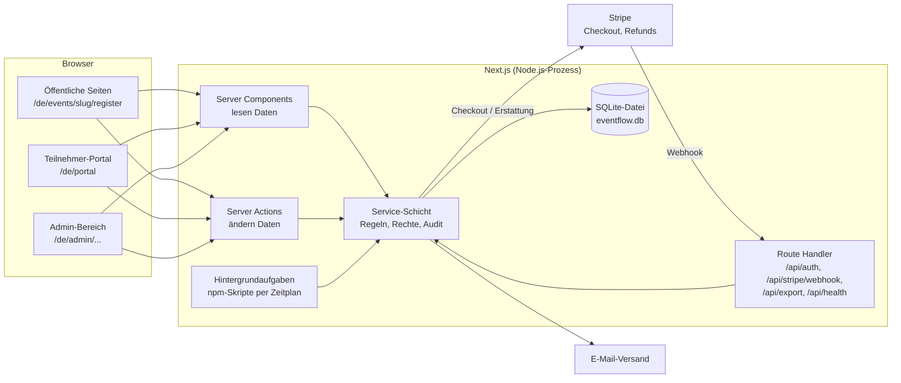
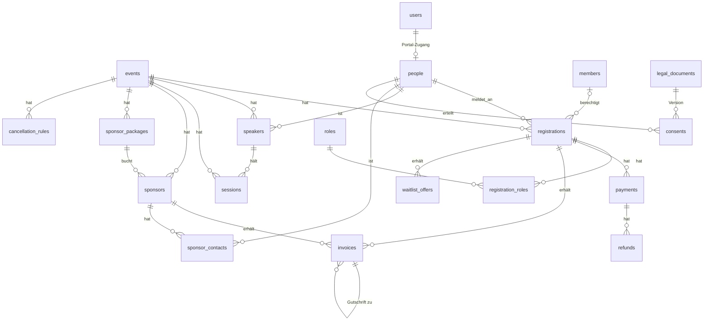

# EventFlow – Migrationsplan: Firebase → Next.js + SQLite

Stand: 26.09.2026 · Status: **Entwurf 2 – Grundsatzentscheidungen eingearbeitet**, noch nichts umgesetzt.
Bezug: `TODO.md` (K1–K6, D1–D9, R1), `specification.md` (aktualisiert: 1.3, 1.4, 2.1, 3.1–3.3, 4.1–4.4, 5.3, 6.3, 7), `COST_ANALYSIS.md` (Mengengerüst), `DEPLOYMENT.md`.

---

## 1. Ziel und Rahmen

- EventFlow wird vollständig von Firebase gelöst (Firestore, Firebase Auth, App Hosting, Cloud Functions, Data Connect, Genkit).
- Neue Basis: **Next.js (App Router) mit Server Actions, SQLite (better-sqlite3) und Drizzle ORM** – dieselbe Grundarchitektur wie im Projekt „vermietung“, ergänzt um Anmeldung, Mehrsprachigkeit, Zahlung und E-Mail.
- **Entwicklungsphase rein lokal** (Windows, `npm run dev`), bis alle Funktionen fertig sind.
- **Produktivbetrieb erst am Schluss** auf einem VPS bei einem EU-Hoster, **ohne Docker** (Node.js als systemd-Dienst hinter Caddy). Siehe `DEPLOYMENT.md`.

### Mengengerüst (aus `COST_ANALYSIS.md` / Spezifikation)

| Größe | Wert |
|---|---|
| Admins | 3–5 |
| Teilnehmer pro Event | ~300 |
| Sitzungen pro Monat | ~300 Admin, ~500 Teilnehmer |
| Datenvolumen | wenige MB, keine großen Dateien |

Auch mit mehreren Events pro Jahr ist SQLite mit großem Abstand ausreichend. Eine einzelne App-Instanz mit einer Datenbankdatei ist bewusst gewählt: kein Datenbankserver, Backup = Dateikopie.

---

## 2. Getroffene Entscheidungen (26.09.2026)

| # | Thema | Entscheidung | Wirkt auf |
|---|---|---|---|
| 1 | Tailwind | **Version 4** (wie „vermietung“); ShadCN-Komponenten werden in Phase 1 mitgezogen | Phase 1 |
| 2 | Sprache | **Deutsch (Standard) und Englisch** – Oberfläche, E-Mails, PDFs, öffentliche Inhalte | Spec 5.3, alle Phasen |
| 3 | Umsatzsteuer | **Kleinunternehmer**; Datenmodell und Rechnungen sind für reguläre USt vorbereitet | Spec 4.4, Phase 7 |
| 4 | Mitgliederpreis | Prüfung gegen eine **im Admin-Bereich hochgeladene Mitgliederliste**; Start mit Dummy-Mitgliedern | Spec 3.1, 4.3, Phase 4/5 |
| 5 | Kapazität | **Kapazitätsgrenze pro Event**, danach Warteliste | Spec 3.1, Phase 5 |
| 6 | Erstattung | **Automatische Rückerstattung**, pro Event umschaltbar auf „mit Freigabe“; manuelle Erstattung jederzeit möglich | Spec 3.3, Phase 8 |
| 7 | Zahlungsarten | **Stripe und Kauf auf Rechnung** | Spec 3.1, Phase 5–7 |
| 8 | Speaker & Sponsoren | **in der ersten Version enthalten** | Phase 4 |
| 9 | Mehrere Events | **von Anfang an Multi-Event**, auch in der Oberfläche | Spec 1.3, Phase 3 |
| 10 | Firestore-Daten | **keine Übernahme**, Start mit leerer Datenbank | – |
| 11 | Hoster & E-Mail-Anbieter | Auswahl **erst zum Deployment** | `DEPLOYMENT.md` |

---

## 3. Zielarchitektur



### Grundprinzipien

1. **Der Browser greift nie direkt auf die Datenbank zu.** Lesen über Server Components, Schreiben über Server Actions bzw. Route Handler.
2. **Jede Server Action prüft Berechtigung und Eingaben selbst** (zod-Schema + Rollenprüfung). `proxy.ts` ist nur eine zweite Verteidigungslinie. → K1, K4, K6.
3. **Geschäftslogik liegt in der Service-Schicht** (`src/server/services/`). Server Actions sind dünn: validieren → Service aufrufen → Ergebnis zurückgeben. Preis, Mitgliedschaft, Kapazität, Erstattungsbetrag und Rechnungsnummer werden nur dort berechnet.
4. **Jede schreibende Operation schreibt einen Audit-Eintrag** in derselben Transaktion. → D8.
5. **Geldbeträge als ganze Cent (INTEGER)**, Steuersätze in Basispunkten (2000 = 20 %), Zeitstempel als ISO-8601-Text in UTC; Anzeige in Europe/Vienna.
6. **Schema-Änderungen nur als neue, versionierte Migration**, automatische Sicherung vor jeder Migration (Mechanismus aus „vermietung“).
7. **Keine personenbezogenen Daten in Logs oder URLs.**
8. **Keine automatisch angelegten Demo-Daten.** Demodaten (inkl. Dummy-Mitglieder) nur über `npm run seed:demo`.
9. **Rechnungen und Gutschriften sind unveränderlich**; Korrekturen erfolgen nur über Gutschriften.
10. **Stripe-Webhooks sind idempotent**; jedes Ereignis wird einmal verarbeitet und protokolliert.

### Mehrsprachigkeit

- Bibliothek **next-intl**; Sprachen `de` (Standard) und `en`; Übersetzungen in `messages/de.json` und `messages/en.json`.
- Alle Seiten liegen unter `/[locale]/…`; ohne Sprachpräfix wird auf `/de/…` umgeleitet.
- Die gewählte Sprache wird bei der Person gespeichert (`people.locale`) und für E-Mails und PDFs verwendet.
- **Von Admins gepflegte Inhalte**, die öffentlich erscheinen (Eventname und -beschreibung, Session-Titel, Sponsorpakete, AGB, Datenschutzerklärung), werden als Sprachobjekt gespeichert: `{"de": "…", "en": "…"}` in einer JSON-Spalte. Deutsch ist Pflicht, Englisch fällt auf Deutsch zurück. Ein gemeinsamer Helfer `localized(value, locale)` und eine Formular-Komponente mit zwei Sprachfeldern sorgen für einheitliche Handhabung.
- Datums-, Zahlen- und Währungsformate über `Intl` mit der jeweiligen Sprache.

### Verzeichnisstruktur (Ziel)

```
messages/                      de.json, en.json
src/
  app/
    [locale]/
      (public)/events/[slug]/…     Eventseite, Anmeldung, Danke-Seite, Warteliste-Angebot
      (public)/datenschutz/…        Datenschutzerklärung (versioniert, aus DB)
      (portal)/portal/…             Teilnehmer-Selbstverwaltung
      (admin)/admin/…               Eventliste, Einstellungen, Mitgliederliste, Log, DSGVO
      (admin)/admin/events/[eventId]/…
                                    Dashboard, Teilnehmer, Speaker, Sponsoren, Programm,
                                    Einstellungen, Erstattungen, Rechnungen, Druckansichten
    api/auth/[...all]/route.ts      Better Auth
    api/stripe/webhook/route.ts
    api/export/…                    XLSX-/JSON-Exporte, PDF-Downloads (nur berechtigt)
    api/health/route.ts             Erreichbarkeits-Check (ohne Daten)
  i18n/                            next-intl-Konfiguration, Routing
  server/                          nur serverseitig (import 'server-only')
    db/        index.ts, schema.ts, migrations.ts
    auth/      Better-Auth-Konfiguration, Rollen-Helfer
    services/  events, registrations, members, pricing, capacity, waitlist,
               payments, refunds, invoices, speakers, sponsors, schedule,
               audit, gdpr, retention, mail, pdf
    actions/   Server Actions je Bereich
  components/  UI (ShadCN) und fachliche Komponenten
  lib/         money.ts, dates.ts, localized.ts, zod-Schemas
scripts/       admin-create, seed-demo, db-backup, retention, jobs
data/          (gitignored) eventflow.db, backups/, mail-outbox/, invoices/
```

### Hintergrundaufgaben

Einige Abläufe sind zeitgesteuert. Sie werden als ein npm-Skript `npm run jobs` gebündelt, das lokal von Hand und produktiv per systemd-Timer (alle 5 Minuten) läuft:
- abgelaufene Reservierungen (`Reserved`) freigeben,
- Wartelisten-Angebote verschicken bzw. nach 48 Stunden an die nächste Person weitergeben,
- Zahlungserinnerungen für fällige Rechnungen,
- täglich: Löschfristen (`retention`) und Sicherung (`db:backup`).

### Was aus „vermietung“ übernommen wird – und was nicht

| Übernehmen | Nicht übernehmen |
|---|---|
| better-sqlite3 + Drizzle, WAL-Modus | Umschalten auf Test-DB per `.test_mode`-Datei zur Laufzeit – stattdessen getrennte `DATABASE_PATH` je Umgebung |
| Eigener Migrationsmechanismus mit Sicherung vor Migration | `db`-Proxy mit `any`-Typ – stattdessen typisierter Export |
| Beträge in Cent, zentrale `money.ts` | Keine Anmeldung / nur LAN-Betrieb |
| `ActionResult`-Muster für Server Actions | Docker-Image, `deploy_to_truenas.py` |
| Versionsstand Next 16 / React 19 / zod 4 / Tailwind 4 | |

---

## 4. Technologie-Stack: alt → neu

| Bereich | Heute | Neu |
|---|---|---|
| Framework | Next.js 15.3, React 18 | Next.js 16, React 19 |
| Laufzeit | – | Node.js 24 LTS |
| Styling | Tailwind 3 | Tailwind 4, ShadCN-Komponenten aktualisiert |
| Sprachen | nur Englisch, fest im Code | next-intl, Deutsch + Englisch |
| Datenhaltung | Cloud Firestore (Client-SDK) | SQLite-Datei via better-sqlite3 + Drizzle ORM |
| Echtzeit | Firestore-Listener (`useCollection`) | entfällt; Aktualisierung nach Server Action (`revalidatePath`) |
| Anmeldung | Firebase Auth, anonym für alle | Better Auth: Admin mit E-Mail + Passwort + 2FA; Teilnehmer per Magic Link |
| Zugriffsschutz | `firestore.rules` (nicht eingebunden) | Rollenprüfung in jeder Server Action / Route + `proxy.ts` |
| Zahlung | – | Stripe Checkout, Refunds, Webhook (Paket `stripe`); Kauf auf Rechnung |
| E-Mail | – | nodemailer; lokal Datei-Ausgabe, produktiv SMTP eines EU-Anbieters; Vorlagen je Sprache |
| PDF | – | `@react-pdf/renderer` für Rechnungen, Gutschriften, Programm |
| Excel | `xlsx` 0.18.5 (bekannte Lücken) | `exceljs` für Export und Import der Mitgliederliste; CSV-Import über `papaparse` |
| QR-Code | statisches Platzhalter-SVG | `qrcode` (eindeutig pro Anmeldung) |
| Druckansichten | HTML-String + `document.write` | React-Seiten mit Print-CSS bzw. PDF (automatisch escaped) |
| Tests | keine (`test/` ist Python-Gerüst) | Vitest für Services; Webhook-Tests mit Stripe-Testereignissen |
| Hosting | Firebase App Hosting | lokal; später EU-VPS mit systemd + Caddy |

### Wird entfernt

`src/firebase/`, `src/ai/`, `functions/`, `dataconnect/`, `test/`, `apphosting.yaml`, `firebase.json`, `.firebaserc`, `firestore.rules`, `firestore.indexes.json`, `.idx/`, `docs/backend.json`, `HOMELAB_DEPLOYMENT.md`, `SPECIFICATION2.md`, doppelte `SPECIFICATION.md`, `CHANGELOG dev.txt`, `CHANGELOG prod.txt` (Inhalt geht in ein gemeinsames `CHANGELOG.md`), `attendees.xlsx`, Pakete `firebase`, `genkit`, `@genkit-ai/*`, `genkit-cli`, `xlsx`, `patch-package`, `dotenv`.

---

## 5. Datenmodell (Entwurf 2)

Zentrale Designentscheidungen:
- **Eine Tabelle `people` für alle Personen.** Teilnehmer, Speaker und Sponsor-Kontakte verweisen auf dieselbe Person. DSGVO-Auskunft und -Löschung laufen über eine Personen-ID (D4).
- **Alles Event-Bezogene trägt `event_id`.** Global sind nur Admins, Mitgliederliste, Veranstalter-Einstellungen, Rollen und Personen.
- **Anmeldestatus und Zahlungsstatus sind getrennt** (Spec 2.1).
- **Rechnungen speichern einen Empfänger-Snapshot**, damit sie nach einer Anonymisierung für die BAO erhalten bleiben (D5).



### Stammdaten und Einstellungen

| Tabelle | Wichtige Felder | Zweck |
|---|---|---|
| `organizer_settings` (eine Zeile) | name, address, vat_id, iban, bic, contact_email, **vat_mode** (`small_business`/`standard`), small_business_note (de/en), invoice_payment_term_days | Rechnungspflichtangaben, USt-Modus (Spec 4.4) |
| `events` | slug (eindeutig), name (de/en), description (de/en), starts_at, ends_at, location, capacity, registration_opens_at, registration_closes_at, price_normal_cents, price_member_cents, ticket_vat_rate_bp, allow_stripe, allow_invoice, refund_mode (`automatic`/`approval`), terms_document_id, archived_at | Multi-Event (Spec 1.3, 4.1, 4.2) |
| `cancellation_rules` | event_id, days_before_event, refund_percent | Stornobedingungen (Spec 3.3) |
| `legal_documents` | kind (`terms`/`privacy`), event_id (nur bei AGB), version, content (de/en), valid_from | versionierte Texte (D1) |
| `roles`, `registration_roles` | key, label (de/en) | Rollen (Spec 2.1, 8.2) |

### Personen, Mitglieder, Anmeldungen

| Tabelle | Wichtige Felder | Zweck |
|---|---|---|
| `people` | first_name, last_name, email (eindeutig, klein), company, phone, **locale**, restricted_at, anonymized_at | eine Person, viele Rollen |
| `members` | member_number (eindeutig), last_name, first_name, email, valid_until | aktuelle Mitgliederliste (Spec 4.3) |
| `member_imports` | uploaded_at, uploaded_by, file_name, row_count, added, removed | Nachweis der Uploads (Liste selbst wird ersetzt) |
| `registrations` | event_id, person_id, **status** (`reserved`/`confirmed`/`waitlisted`/`cancelled`), **payment_status** (`open`/`paid`/`partially_refunded`/`refunded`/`not_required`), **payment_method** (`stripe`/`invoice`/`free`), ticket_type (`normal`/`member`), member_id, member_number_entered, price_cents, billing_company, billing_address, source (`public`/`admin`), reserved_until, created_at, confirmed_at, cancelled_at, cancel_reason, checked_in_at, qr_token | Spec 2.1, 3.1 |
| `waitlist_offers` | registration_id, offered_at, expires_at, accepted_at, declined_or_expired_at | 48-Stunden-Angebote (Spec 3.1) |
| `consents` | person_id, kind (`terms`/`privacy`/`photo`/`newsletter`), document_id, granted_at, revoked_at, source | D2, D3 |

### Zahlung, Erstattung, Rechnungen

| Tabelle | Wichtige Felder | Zweck |
|---|---|---|
| `payments` | registration_id **oder** sponsor_id, method (`stripe`/`bank_transfer`), stripe_checkout_session_id (eindeutig), stripe_payment_intent_id, amount_cents, status, paid_at, recorded_by | Stripe-Zahlungen und manuell verbuchte Überweisungen |
| `refunds` | payment_id, amount_cents, **status** (`proposed`/`approved`/`executed`/`rejected`/`failed`), reason, calculated_by_rule, stripe_refund_id, proposed_at, decided_by, decided_at, executed_at | automatische und freizugebende Erstattungen (Spec 3.3) |
| `invoices` | **type** (`invoice`/`credit_note`), number (eindeutig, `2026-0001`), related_invoice_id, registration_id **oder** sponsor_id, locale, issued_at, due_at, recipient_snapshot (JSON), organizer_snapshot (JSON), vat_mode, net_cents, vat_rate_bp, vat_cents, gross_cents, pdf_path, retain_until | unveränderliche Belege (Spec 4.4, R1) |
| `invoice_counters` | year, last_number | lückenlose Nummer in einer Transaktion (gemeinsamer Nummernkreis für Rechnungen und Gutschriften) |
| `payment_reminders` | invoice_id, sent_at, level | Zahlungserinnerungen |
| `stripe_events` | stripe_event_id (eindeutig), type, received_at, processed_at, result | Idempotenz des Webhooks |

### Programm, Speaker, Sponsoren

| Tabelle | Wichtige Felder |
|---|---|
| `speakers` | event_id, person_id, proposal_status, slides_status |
| `sessions` | event_id, title (de/en), starts_at, ends_at, location, tag, stream, speaker_id |
| `sponsor_packages` | event_id, name (de/en), benefits (de/en), price_cents, vat_rate_bp |
| `sponsors` | event_id, company_name, package_id, billing_address, discount_cents, due_on, payment_status |
| `sponsor_contacts` | sponsor_id, person_id, function |

### Betrieb und DSGVO

| Tabelle | Wichtige Felder |
|---|---|
| `audit_log` | at, actor_user_id, event_id, action, entity, entity_id, summary (ohne Personendaten) |
| `dsr_requests` | person_id, type, received_at, completed_at, handled_by |
| `user`, `session`, `account`, `verification`, `twoFactor` | von Better Auth vorgegeben; Rolle `admin` bzw. `attendee` |
| `app_migrations` | id, applied_at |

### Kapazitätsregel

Belegte Plätze eines Events = Anmeldungen mit Status `confirmed` + `reserved` (mit `reserved_until` in der Zukunft). Die Prüfung und das Anlegen der Anmeldung geschehen in **einer** SQLite-Schreibtransaktion (`BEGIN IMMEDIATE`), damit zwei gleichzeitige Anmeldungen nicht beide den letzten Platz bekommen.

### Preis- und Steuerberechnung

Preise sind Bruttobeträge. Bei `small_business`: USt-Satz 0, net = gross, Hinweistext auf der Rechnung. Bei `standard`: net = round(gross × 10000 / (10000 + rate_bp)), vat = gross − net. Die Berechnung liegt in einer einzigen, getesteten Funktion in `services/pricing`.

---

## 6. Abbildung der bestehenden Funktionen

| Heute | Neu |
|---|---|
| Automatische anonyme Anmeldung für alle | Nur öffentliche Seiten ohne Anmeldung; Admin-Login mit 2FA; Portal per Magic Link |
| Ein fest verdrahtetes Event (`evt1`) | Eventliste, Event-Umschalter, Anlegen/Kopieren/Archivieren |
| `/register` schreibt direkt in Firestore, Status „Confirmed“, leitet auf `/attendees` | `/{locale}/events/{slug}/register`: Mitgliedsprüfung, Kapazität, Zahlungsart → Stripe Checkout bzw. Rechnung → Danke-Seite + E-Mail |
| Preis im Browser, jede PMI-Nummer gibt Rabatt | Preis und Mitgliedschaft nur serverseitig gegen die hochgeladene Mitgliederliste |
| Event-Seite speichert in `localStorage` | Event-Einstellungen in `events`, zweisprachige Texte, versionierte AGB |
| Teilnehmerliste mit Firestore-Listener | Server Component; Filter/Sortierung weiter im Browser; zusätzliche Filter Zahlungsstatus/-art |
| „Unregister“ löscht hart | „Stornieren“ setzt `cancelled` und stößt die Erstattung nach Stornobedingungen an |
| „Create invoice“ nur Toast | echte Rechnung (PDF, Sprache der Person), fortlaufende Nummer, Versand per E-Mail |
| Druck per `document.write` | Druckseiten bzw. PDF |
| Audit-Log-Platzhalter | Liste aus `audit_log`, filter- und durchsuchbar |
| DSGVO-Seite mit E-Mail-Suche in zwei Sammlungen | Suche → Person → vollständiger Export, Einschränken/Anonymisieren mit Aufbewahrungslogik, Anfrageprotokoll |
| Dashboard/Reporting mit Fantasiezahlen | Kennzahlen je Event aus der Datenbank; Jahresumsatz-Übersicht für die Kleinunternehmergrenze |
| Auto-Seeding von Programm und Sponsorpaketen | entfällt; `npm run seed:demo` |
| Downloads-Seite mit Projektdoku | entfällt |
| Header: Suche, Settings, Support, Logout ohne Funktion | Sprachumschalter, Event-Umschalter, Logout; Rest entfernen oder umsetzen |

---

## 7. Vorgehen in Phasen

Jede Phase endet mit einer lauffähigen App, grünem `typecheck`/`lint`/`test`, aktualisierter Doku und einem Commit. Gearbeitet wird auf dem Branch `migration/sqlite`; der heutige Stand wird als Tag `firebase-final` festgehalten.

| Phase | Inhalt | Erledigt |
|---|---|---|
| **0 – Vorbereitung** | Tag `firebase-final`, Branch anlegen; doppelte Spec/Changelogs bereinigen; `.env.example`; Node 24 festlegen (`engines`, `.nvmrc`) | – |
| **1 – Fundament** | Firebase/Genkit/Data Connect/Functions entfernen; Next 16 / React 19; **Tailwind 4** + ShadCN-Update; **next-intl** mit `de`/`en`, Sprachumschalter; `ignoreBuildErrors` raus, Typ- und Lint-Fehler beheben; `src/server/db` mit Migrationsmechanismus; Basisschema; Vitest; `seed:demo` | K5, K6 |
| **2 – Anmeldung & Rechte** | Better Auth; Admin-Login mit 2FA; `npm run admin:create`; `proxy.ts` + Rollenprüfung in allen Actions; Logout | K1 |
| **3 – Events & Einstellungen** | Eventliste, Anlegen/Kopieren/Archivieren, Event-Umschalter; Event-Einstellungen inkl. Kapazität, Zahlungsarten, Stornobedingungen, Erstattungsmodus; zweisprachige Inhalte; Veranstalterdaten + USt-Modus; versionierte AGB/Datenschutz | Spec 1.3, 4.1, 4.2 |
| **4 – Admin-Fachfunktionen** | Teilnehmer (Stornieren statt Löschen), Speaker, Sponsoren + Pakete, Programm; **Mitgliederliste hochladen** (Vorschau, Ersetzen, Protokoll); Audit-Log in allen Services + Log-Seite; Druckansichten als React; Excel-Export mit exceljs | K3, D8, Spec 4.3 |
| **5 – Öffentliche Anmeldung** | Eventseite + Formular (de/en); Mitgliedsprüfung; Kapazität/Warteliste; Duplikatprüfung; Zahlungsart-Auswahl; Kauf auf Rechnung vollständig; Danke-Seite; Datenschutzseite; Zustimmungen; Foto-/Newsletter-Opt-in; Honeypot + Rate-Limit | K2, D1–D3 |
| **6 – Stripe** | Checkout mit serverseitigem Preis; Reservierung mit Ablauf; Webhook mit Signaturprüfung und Idempotenz; Wartelisten-Angebote mit Zahlungslink; `npm run jobs`; lokal mit Stripe CLI | K4 |
| **7 – Rechnungen & E-Mail** | Nummernkreis, Rechnungs- und Gutschrift-PDF (de/en) mit Pflichtangaben, Kleinunternehmer-Hinweis und USt-Vorbereitung; E-Mail-Vorlagen de/en; Zahlungseingang manuell verbuchen; Zahlungserinnerungen | R1 |
| **8 – Storno & Erstattung** | Erstattungsbetrag nach Stornobedingungen; Modus automatisch/mit Freigabe; Freigabeliste für Admins; manuelle Erstattung mit Begründung; Stripe-Refund + Webhook-Abgleich; Erstattung bei Überweisung verbuchen; Gutschrift + E-Mail | Spec 3.3 |
| **9 – Teilnehmerportal** | Magic-Link-Login; eigene Daten ansehen/ändern; Rechnungen herunterladen; Stornierung (nutzt Phase 8) | Spec 3.2 |
| **10 – DSGVO-Werkzeuge** | Export (JSON + XLSX), Einschränken/Anonymisieren mit BAO-Aufbewahrung, Anfrageprotokoll, `npm run retention` | D4–D7 |
| **11 – Kennzahlen & Check-in** | Dashboard/Reporting je Event; Jahresumsatz-Übersicht; echter QR-Code und Check-in am Eingang | – |
| **12 – Release-Vorbereitung** | Backup-/Restore getestet; Doku aktualisiert; Go-live-Checkliste aus `DEPLOYMENT.md` | D9 (organisatorisch) |

---

## 8. Vorschläge zur Bestätigung

Diese Details ergeben sich aus den Entscheidungen. Ich habe jeweils einen Vorschlag in die Spezifikation geschrieben – bitte bestätigen oder ändern:

1. **Mitgliedsprüfung:** Mitgliedsnummer **und** Nachname müssen übereinstimmen (nicht nur die Nummer), damit sich Nummern nicht einfach durchprobieren lassen. Ohne Treffer gilt der Normalpreis mit Hinweis. *(Spec 3.1)*
2. **Upload der Mitgliederliste:** Pflichtspalten Mitgliedsnummer + Nachname; jeder Upload **ersetzt** die ganze Liste; Vorschau vor dem Übernehmen. *(Spec 4.3)*
3. **Kauf auf Rechnung:** nur mit Firmenname und Rechnungsadresse; Anmeldung ist **sofort bestätigt**, Zahlungsstatus „offen“, Zahlungsziel aus den Einstellungen (Vorschlag 14 Tage), Erinnerung nach Fälligkeit, **keine automatische Stornierung**. *(Spec 3.1)*
4. **Stripe-Reservierung:** Platz wird für die Gültigkeit des Checkouts gehalten (Vorschlag 30 Minuten), danach automatisch frei. *(Spec 3.1)*
5. **Warteliste:** bei freiem Platz automatisches Angebot per E-Mail mit Zahlungslink, **48 Stunden** gültig, danach nächste Person; Admin kann manuell nachrücken lassen. *(Spec 3.1)*
6. **Stornobedingungen:** pro Event als Staffel „bis X Tage vorher → Y % Erstattung“. Erstattungsmodus pro Event: automatisch oder mit Freigabe. *(Spec 3.3)*
7. **URLs:** Sprache immer im Pfad (`/de/…`, `/en/…`); öffentliche Eventseiten über einen Kurznamen (`/de/events/pm-summit-2027`). *(Spec 1.3, 5.3)*
8. **Admin-Rechte:** alle Admins haben gleiche Rechte auf alle Events (keine Rechte pro Event). Reicht das?
