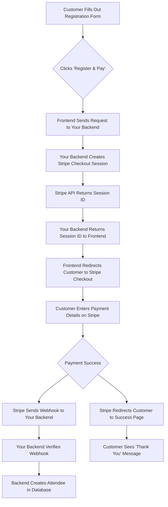
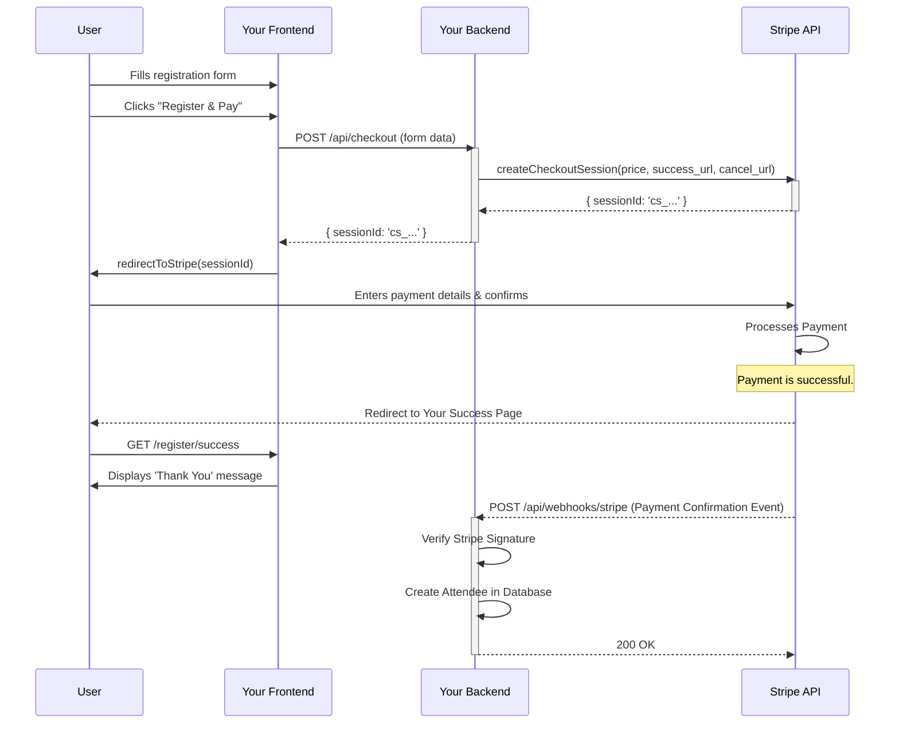

# Stripe Payment Integration Plan for EventFlow

This document summarizes the process, requirements, and workflow for integrating Stripe to handle payments for event registrations.

## Executive Summary & CFO Action Items

To integrate Stripe for payment processing, we need a pair of API keys from the Stripe account for both testing and the final production environment. The application's developer **does not** need access to the Stripe dashboard. The keys must be provided securely and will be stored as environment variables on the server, never in the code itself.

**Required from CFO:**

1.  **For Testing:** Please log in to the Stripe Dashboard, ensure **"Test mode"** is active, go to `Developers > API Keys`, and provide the following two keys:
    *   `Publishable Key (Test)` (starts with `pk_test_...`)
    *   `Secret Key (Test)` (starts with `sk_test_...`)

2.  **For Production (Live Payments):** After successful testing, please switch to **"Live mode"** in the Stripe Dashboard and provide the live keys:
    *   `Publishable Key (Live)` (starts with `pk_live_...`)
    *   `Secret Key (Live)` (starts with `sk_live_...`)

---

## Developer Action Items: Handling the Keys

Once you receive the API keys from the CFO, they must be stored as environment variables. This keeps them secure and separate from the application code.

**For Local Development & Testing:**

1.  In the root directory of your project, create a new file named `.env.local`. **This file should never be committed to your code repository (e.g., Git).**

2.  Open the `.env.local` file and add the keys you received from the CFO, using the following specific names:

    ```
    # .env.local

    # For the Frontend (safe to be public in the browser)
    NEXT_PUBLIC_STRIPE_PUBLISHABLE_KEY=pk_test_xxxxxxxxxxxxxxxxxxxxxxxx

    # For the Backend (must be kept secret on the server)
    STRIPE_SECRET_KEY=sk_test_xxxxxxxxxxxxxxxxxxxxxxxx
    ```

    *   The `NEXT_PUBLIC_` prefix on the publishable key is a Next.js convention that exposes the variable to the browser (the frontend).
    *   The secret key has no prefix and will only be available on the server-side, keeping it secure.

**For Production Deployment:**

When you deploy your application to a hosting provider (like Vercel or Firebase App Hosting), you will **not** use the `.env.local` file. Instead, you will configure these same environment variables in your hosting provider's web dashboard. This ensures your keys remain secure in the live environment.

---

## Detailed Integration Workflow

Integrating Stripe involves a secure workflow that ensures customer payment details are never handled by our application directly, significantly reducing our PCI compliance scope. The process relies on creating a server-side Checkout Session, redirecting the user to a secure Stripe-hosted payment page, and using Webhooks to confirm payment before creating the attendee record.

### Key Components

*   **Your Application (EventFlow):**
    *   **Frontend:** The public registration page the customer sees.
    *   **Backend:** A secure, server-side part of our application that communicates with Stripe.
*   **Stripe API:** Stripe's services for creating payment sessions and confirming transactions.
*   **Customer's Browser:** The web browser the customer is using.

---

## Diagrams

### Activity Diagram

This diagram shows the flow of activities between the customer, your application, and Stripe.



### Sequence Diagram

This diagram shows the sequence of interactions between the different components over time. It provides a more technical view of the API calls.



---

## Step-by-Step Process Explained

1.  **Customer Initiates Registration:**
    *   A customer fills out the public registration form on your website.
    *   When they click the final "Register and Pay" button, the frontend **does not** immediately save them as an attendee.

2.  **Server Creates Checkout Session:**
    *   The frontend sends the registration details (e.g., ticket type to determine the price) to a secure backend API endpoint within the EventFlow application.
    *   This backend endpoint uses the **Secret Key** to make a secure call to the Stripe API, requesting to create a "Checkout Session." This session object contains the price, currency, and the URLs where Stripe should send the user after a successful or failed payment.

3.  **Redirect to Stripe:**
    *   The Stripe API responds with a unique ID for the Checkout Session.
    *   Your backend sends this ID back to the frontend.
    *   The frontend uses Stripe's client-side JavaScript library (`stripe-js`) and the **Publishable Key** to redirect the customer away from your site and onto the secure, Stripe-hosted checkout page.

4.  **Secure Payment:**
    *   The customer is now on a URL hosted by `stripe.com`. They enter their credit card information directly into Stripe's fields.
    *   **Crucially, this sensitive information never touches your application's servers.**

5.  **Payment Confirmation via Webhook:**
    *   After the payment succeeds, Stripe sends a `checkout.session.completed` event to a pre-configured "webhook" endpoint on your backend. This is an asynchronous, out-of-band notification.
    *   Your backend receives this event, verifies its cryptographic signature to confirm it's genuinely from Stripe, and then securely creates the `Attendee` record in your Firestore database.
    *   This is the most reliable way to confirm payment, as it happens server-to-server and doesn't depend on the customer's browser behavior.

6.  **Customer Returns to Your Site:**
    *   Simultaneously, Stripe redirects the customer's browser to the success URL you specified in step 2 (e.g., `your-app.com/register/thank-you`).
    *   This page can then display a confirmation message to the user.

This workflow ensures a secure, reliable, and professional payment experience for your customers while minimizing the security and compliance burden on your application.
